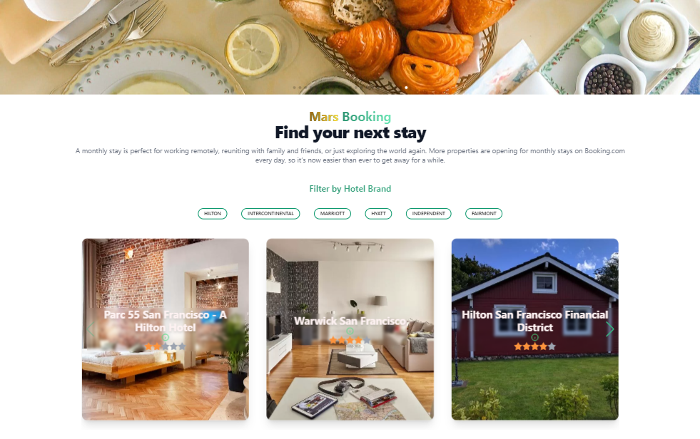

# React.JS Hotels booking website  

responsive Hotels booking website

it have list of hotels,slider ,filter  with details page for more info about the hotel 

Each hotel have  data stored in json server 

user can  book any  hotel by clicking on "book" button and enter his name, email, and 

phone number in the form  

and the  user can  book multiple,

hotels.and cancel a booking.

the  user able to see all his bookings.

## Features

- Light/dark mode toggle
- Responsive
- json server 
- error and loading handling 
- global state management with redux
- handel asynchronous calls with Redux Thunk 
- form validation with  react Hook form
- using Vite  module bundler
- using react query
- using react router
- using swiper the most modern touch slider with transitions amazing  behavior
- using tailwindcss and daisyui  for styling
- Authentication with firebase

## API Reference

#### Get all Hotels

```http
 GET /hotels
```


#### Get the primary information about a Hotel.

```http
  GET /Hotel/{Hotel_id}
```

| Parameter | Type     | Description                       |
| :-------- | :------- | :-------------------------------- |
| `id`      | `string` | **Required**. Id of item to fetch |

#### Get the user bookings

```http
  GET /cart
```

## Installation

Install my-project with npm

```bash
  cd React.JS Hotels booking website
  npm install 
  npx json-server --watch data/db.json --port 3001
  npm run dev
 
```

## Acknowledgements

 - [swiperjs](https://swiperjs.com/demos#space-between)
 - [redux-toolkit](https://redux-toolkit.js.org/)
 - [react-router](https://reactrouter.com/en/main)
 - [redux-thunk](https://redux.js.org/usage/writing-logic-thunks)
 - [tailwind css](https://tailwindcss.com/)
 - [daisy ui](https://daisyui.com/)
 - [vite js](https://vitejs.dev/)
 - [hero icons](https://heroicons.com/)
 - [surge](https://surge.sh/)
 - [vercel](https://vercel.com)
 - [firebase](https://firebase.google.com)
 
## Demo

 link to demo

[deployed on  surge ](https://gusty-destruction.surge.sh/)
## Watch the video

[](./hotel.wmv)

## images


